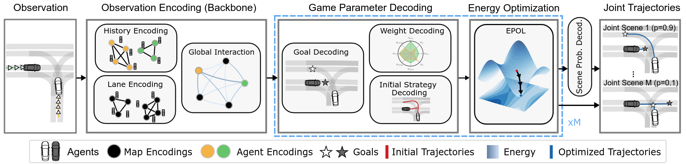

<div align="center">
    
    <h1 align="center">Energy-based Potential Games for Joint Motion Forecasting and Control</h1>
    <h3 align="center"><a href="https://openreview.net/pdf?id=Eyb4e3GBuuR">Paper</a>  | <a href="https://www.youtube.com/watch?v=l6ViD7gvG2o">Video</a> </h3>
</div>

<br/>

> [**Energy-based Potential Games for Joint Motion Forecasting and Control**](https://arxiv.org/abs/2312.01811)  <br>
> [Christopher Diehl](https://scholar.google.de/citations?user=8HsbmCMAAAAJ&hl=en)<sup>1</sup>, [Tobias Klosek]()<sup>1</sup>, [Martin Krüger](https://scholar.google.com/citations?user=LA8gmTIAAAAJ&hl=de)<sup>1</sup>, [Nils Murzyn](https://www.google.com/url?sa=t&rct=j&q=&esrc=s&source=web&cd=&cad=rja&uact=8&ved=2ahUKEwjAgcfwmv6EAxX3gv0HHQ5_DZ4QFnoECBMQAQ&url=https%3A%2F%2Fwww.linkedin.com%2Fin%2Fnils-murzyn&usg=AOvVaw0RMqNrJK5h_NTtpNDzS3D6&opi=89978449)<sup>2</sup>, [Timo Osterburg](https://scholar.google.com/citations?hl=en&user=vl_7Cm8AAAAJ&view_op=list_works)<sup>1</sup> and [Torsten Bertram](https://rst.etit.tu-dortmund.de/lehrstuhl/team/bertram/)<sup>1</sup>   <br>
> <sup>1</sup> Technical University Dortmund, <sup>2</sup>  ZF Friedrichshafen AG, Artificial Intelligence Lab<br>
> <br>
> Conference on Robot Learning (CoRL), 2023 <br>
> 
<br/>


## Overview

- Abstract: This work uses game theory as a mathematical framework to address interaction modeling in multi-agent motion forecasting and control. Despite its interpretability, applying game theory to real-world robotics, like automated driving, faces challenges such as unknown game parameters. To tackle these, we establish a connection between differential games, optimal control, and energy-based models, demonstrating how existing approaches can be unified under our proposed Energy-based Potential Game formulation. Building upon this, we introduce a new end-to-end learning application that combines neural networks for game-parameter inference with a differentiable game-theoretic optimization layer, acting as an inductive bias.
- This repository includes the code for training and evaluation of the proposed Enery-based Potential Game approach (**EPO**) approach and another joint prediction baseline (see **+SC** in the [paper](https://openreview.net/pdf?id=Eyb4e3GBuuR) ) for the Waymo Open Motion Dataset.

<br/>


## Method

> We decompose the modeling multi-agent interactions into two subtasks: (1) A neural network encodes the scene (agent histories and map information) and models global interaction. The resulting encoding is used to decode game-parameters and initial control sequences of all agents. (2) We construct an energy (joint cost) based on the use the inferred game parameters. The joint cost function is then minimized using gradient-based optimization, starting from the predicted initialization. We perform parallel energy optimizations (one for each mode) resulting in different future scene evolutions. 

## Getting started

### 1. Installation 
For installation, please follow these steps:
- Download the Waymo Open Motion dataset (Version 1.2.0) ([described here](https://waymo.com/open/download/)) 
- Clone the repository
```
git clone https://github.com/rst-tu-dortmund/diff_epo_planner.git 
```
- Create a new conda environment from the provided environment file (epo_waymo.yml)
```
conda env create -f epo_waymo.yml
```
- Activate the environment
The environment was tested on a machine with Ubuntu 18.04 with NVIDIA RTX 3090 and Ubuntu 22.04 with NVIDIA RTX 2080 Super. 

### 2. Data Processing
The first step is to preprocess the downloaded dataset. This repository provides a script to preprocess the Waymo Open Motion dataset, which is located in the *data/utils* subfolder. The script will create a new folder with the processed data. Preprocessing leads to significant improvements in terms of training times.
```
cd data/utils
python preprocess_waymo.py 
--data_path= *PATH_TO_WAYMO_DATASET* 
--save_path= *PATH_TO_SAVE_PROCESSED_DATA*
--configs=*PATH_TO_JSON/*configs_eponet.json
--n_parallel= *NUMBER_OF_PARALLEL_PROCESSES*
```
- Setting n_parallel to a high value reduces the runtime of the preprocessing. 
- _data_path_ is the path to the folder containing the tfrecord files (e.g., YOUR_PATH/waymo/v_1_2_0/scenario/training).
- Please run the script for the _training_ subfolder and the _validation_interactive_ subfolder.

### 3. Training 
- Both models can be trained with the following command:
```
python train_scene_prediction.py --configs= configs_*MODELNAME*.json
```
- Please ensure that you specify a valid model path. The _dataset_waymo_, specified in the json-config, should contain the following subfolders, whereas _data_ contains the data after the preprocessing:
```
dataset_waymo/
├── train/
│ └── data/
└── val/
  └── data/
```

- Please also set the _storage_path_ to a folder where the checkpoints will be stored on your device.
- We use [Weights & Biases](https://wandb.ai/site) for logging. You can register an account for free. The _entity_ can also be set in the configs_*MODELNAME*.json

### 4. Evaluation 
We also provide a script for evaluating trained models. Please set the _model_path_ in the configs accordingly.
Trained checkpoints of (eponet or scnet) can be evaluated with:
```
python evaluate_scene_prediction.py --configs= configs_*INSERT_MODEL_NAME_HERE*.json
```
Due to the policy of the Waymo Open Motion dataset, we are not able to provide pre-trained checkpoints.

## 5. Results 
Please refer to [results](docs/results.md).

## Contact
Please feel free to open an issue or contact us (christopher.diehl@tu-dortmund.de), if you have any questions or suggestions.

## Citation
If you find our repo useful, please consider citing our paper with the following BibTeX entry and giving us a star :star:

```BibTeX
@InProceedings{Diehl2023CoRL,
  title={Energy-based Potential Games for Joint Motion Forecasting and Control},
  author={Diehl, Christopher and Klosek, Tobias and Krueger, Martin and Murzyn, Nils and Osterburg, Timo and Bertram, Torsten},
  booktitle={Conference on Robot Learning (CoRL)},
  year={2023}
}
```

```BibTeX
@article{Diehl2023ICMLW,
  title={On a Connection between Differential Games, Optimal Control, and Energy-based Models for Multi-Agent Interactions},
  author={Diehl, Christopher and Klosek, Tobias and Krueger, Martin and Murzyn, Nils and Bertram, Torsten},
  booktitle={International Conference on Machine Learning, Frontiers4LCD Workshop},
  year={2023}
}
```

## Acknowledgments
This work was supported by the Federal Ministry for Economic Affairs and Climate Action on the basis of a decision by the German Bundestag and the European Union in the Project KISSaF - AI-based Situation Interpretation for Automated Driving.